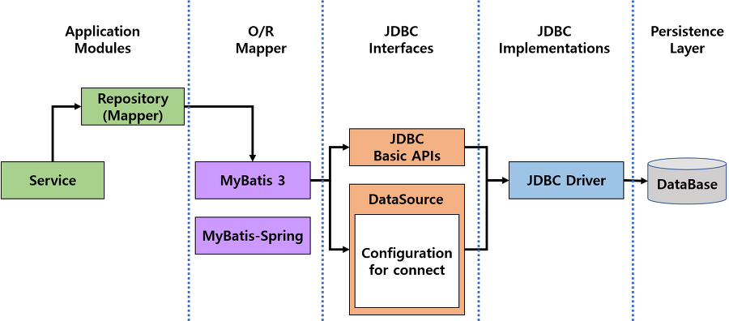
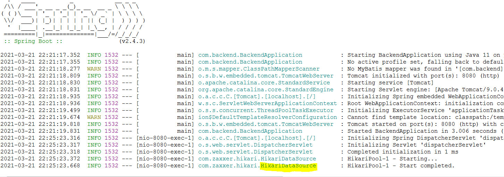

## Springboot에 DB연동하기

### JDBC? DBCP?

Spring Boot는 기본적으로 JDBC를 제공하며, v2.0부터 HikariCP라는 DBCP를 제공한다. 

 JDBC와 DBCP는 자바 웹 어플리케이션에서 DB 접속과 관련된 라이브러리이다. 

- JDBC

  Java Database Connectivity 의 약자로 **자바에서 데이터베이스에 연결하기 위한 인터페이스**이다. Oracle, MySQL, MariaDB 등 **데이터베이스는 각각의 Driver를 제공**하는데, JDBC는 이 **Driver를 통해 DB에 접속**한다. 

- DBCP

  Database Connection Pool의 약자로 **DB와 커넥션을 맺고 있는 객체를 관리**하는 역할을 한다. DBCP를 사용하는 이유는 **효율** 때문이다. 

  JDBC만을 사용할 경우 다음과 같은 순서가 반복된다. 

  1. DB 접속을 위해 JDBC가 Driver 로드
  2. `getConnection` method로 부터 DB 커넥션 객체를 얻음
  3. 쿼리 수행을 위한 `PreparedStatement` 객체 생성
  4. `excuteQuery`를 실행하여 결과를 받아옴

  이때 DBCP를 이용하면  **WAS 실행 시 미리 일정량의 `DB Connection` 객체를 생성하고 `Pool`이라는 공간에 저장해두었다가 DB 연결 요청이 있을때마다 `Pool`에서 `Connection` 객체를 가져다 쓰고 처리가 끝나면 반환**하는 방식으로 1~2번의 과정을 효율적으로 처리한다. 

  

  

### Mybatis?

자바 오브젝트와 SQL 사이의 자동 매핑 기능을 지원하는 ORM 프레임워크이다. SQL을 별도의 파일로 분리해서 관리하게 해준다. 

JDBC만을 사용하는 어플리케이션은 Application Modules에서 JDBC Interfaces를 바로 호출하지만 Mybatis를 사용하는 경우 이 Mybatis가 JDBC Interfaces를 감싸서 개발자가 조금 더 편리하게 DB에 접근할 수 있도록 도와준다. 




## DB 연동하기

### 1. Mybatis, MariaDB 의존성 추가

```java
// build.gradle

dependencies {
    ...
    // DB
	implementation 'org.mybatis.spring.boot:mybatis-spring-boot- 	starter:2.1.3'
	runtimeOnly 'mysql:mysql-connector-java'
}
```

- 의존성을 추가한 다음 `프로젝트 우클릭 > Gradle > Reflesh Gradle Project` 


### 2. DB 연결정보 설정

```java
// application.properties

spring.datasource.driver-class-name=com.mysql.cj.jdbc.Driver
spring.datasource.jdbc-url=jdbc:mysql://localhost:3306/[DB이름]?useUnicode=true&characterEncoding=utf-8
spring.datasource.username=[username]
spring.datasource.password=[password]
```


어플리케이션을 구동하면 아래와 같이 확인할 수 있다!

