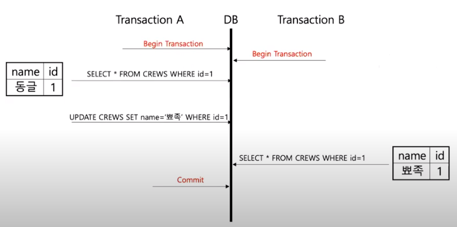
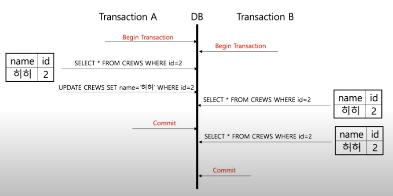
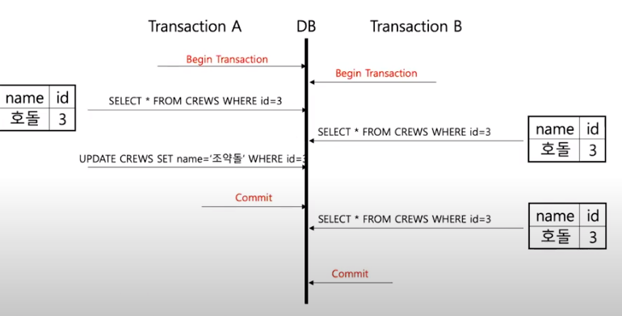

## 트랜잭션(Transaction)

> 아프리카TV에서 청취 이벤트를 개발하면서 청취 로그 데이터를 저장하는 과정에서 트랜잭션이 필요하여 공부하며 정리한 내용이다.

### 트랜잭션이란

한 마디로 정의하면 **한꺼번에 모두 수행되어야 하는(쪼개질 수 없는) 업무 처리 단위**이다.

예를 들어, A 은행에서 출금하려 B은행으로 송금해야하는 경우를 생각해보자. A 은행에서 출금은 했지만 B 은행으로 송금하는 상황에서 오류가 발생하면 A 은행 계좌에서 출금한 돈을 다시 되돌려야한다.

이러한 경우를 방지하기 위해 거래가 A, B 은행에서 모든 거래가 성공적으로 끝나야만 이를 완전한 거래로 승인하고, 거래 도중 오류가 발생하면 이 거래를 처음부터 없던 거래로 완전히 되돌리는 것이다.

즉, **데이터베이스에서 테이블을 읽어온 후 다른 테이블에 데이터를 갱신, 삭제하는 처리 도중 오류가 발생하면 모든 작업을 원 상태로 되돌릴 수 있으며** 이때 하나의 처리 단위가 트랜잭션인 것이다. 


### 트랜잭션 처리 방법

데이터베이스의 명령어

- 커밋(Commit) : 커밋한 변경사항을 한꺼번에 DB에 반영하는 것
- 롤백(Rollback) : 부분 작업이 실패하면 트랜잭션 실행 전으로 되돌리는 것


이 과정을 처리하기 위해 **트랜잭션은 2개 이상의 쿼리를 하나의 Connection 객체로 묶어 DB에 전송**한다.


### Spring에서 트랜잭션 사용하기

Spring은 코드 기반의 트랜잭션과 선언적 트랜잭션을 지원한다. Spring이 지원하는 트랜잭션 클래스를 이용하거나 어노테이션을 이용해 트랜잭션의 범위 및 규칙을 정의할 수 있다. 오늘은 어노테이션 사용 방법에 대해 알아보겠다.

`@Transactional` 어노테이션

- 일반적으로 service layer에 어노테이션을 추가하여 트랜잭션 처리를 한다. 

- 어노테이션은 메소드 뿐만 아니라 인터페이스, 클래스 선언에도 사용할 수 있다. 


### @Transactional 옵션

격리 레벨

데이터를 트랜잭션으로 처리하고 있는 도중 다른 곳에서 데이터에 대한 접근 요청할 때 어떻게 처리할 것인가?에 대한 고려가 필요한다. 이를 위해 격리 레벨을 설정하여 데이터 접근 허용 수준을 결정할 수 있다.

데이터의 정합성이 커질수록 프로그램의 성능이 떨어지므로 필요에 따라 격리 레벨을 잘 선택하는 것이 필요하다.

```java
// 사용 예시
@Transactional(isolation=Isolation.DEFAULT)
```

- DEFAULT

  - 데이터베이스에서 설정된 기본 격리 수준을 따른다.

- READ_UNCOMMITED 

  

  - 아직 커밋되지 않은(트랜잭션 처리 중인) 데이터를 읽을 수 있다. 

  - 즉, 어떤 사용자가 A라는 데이터를 B라는 데이터로 변경하는 동안 다른 사용자는 B데이터(완료되지 않은)를 읽을 수 있다(**Dirty Read**)

- READ_COMMITED

  

  - 커밋된 데이터만 읽을 수 있다. 

  - 어떤 사용자가 A라는 데이터를 B라는 데이터로 변경하는 동안 다른 사용자는 해당 데이터에 접근할 수 없다.

  - 같은 트랜잭션 내에서 데이터를 조회할 때 다른 값이 조회되는 문제가 발생한다(**Non-Repeatable Read**).

- REPEATEABLE_READ 

  

  - 마찬가지로 커밋이 완료된 데이터만 읽을 수 있다.

  - READ_COMMITED와 차이점은 한 트랜잭션이 조회한 데이터는 다른 트랜잭션이 수정하는 것을 막으므로 한번 조회한 데이터는 반복적으로 조회해도 동일한다.

  - 한 트랜잭션 내에서 같은 쿼리를 두번 수행할 때 그 사이의 다른 트랜잭션이 값을 수정 또는 삭제함으로써 두 쿼리의 결과가 상이하게 나타나는 Non-Reapeatable Read를 방지할 수 있다.

- SERIALIZABLE 

  한 트랜잭션에서 사용하는 데이터를 다른 트랜잭션이 접근 불가능하다.


### 참고

https://velog.io/@sa833591/Spring-Transactional-%EC%98%B5%EC%85%98

https://www.youtube.com/watch?v=e9PC0sroCzc