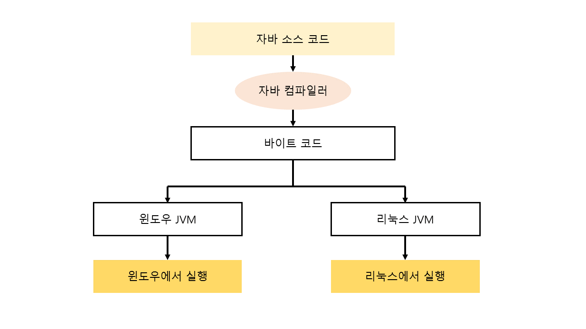

# 빌드와 배포

## 컴파일이란?

**소스코드**를 **바이너리 코드**\(컴퓨터가 이해하는 기계어\)로 변환하는 과정

* 이 작업을 해주는 것이 **컴파일러**
* Java의 경우byte code 의 파일\(`.class`\) 생성하고  JVM에서 실행
  * `bin` 폴더에 저장
  * `javac` 은 컴파일 명령어
* IDEA에서 `Run` 버튼을 누를 때 **컴파일+실행** 동시에 발생

```java
// HelloWorld.java

public class HelloWorld{
    public static void main(String[] args){
        System.out.println("Hello, World!");
    }
}
```

위 코드를 터미널에서 실행하면 다음과 같은 에러가 발생한다

```bash
$ java HelloWorld
Error: Could not find or load main class HelloWorld
Caused by: java.lang.ClassNotFoundException: HelloWorld
```

아직 코드가 컴파일되지 않았기 때문에 컴퓨터가 코드를 이해할 수 없다!!!!

```bash
$ javac HelloWorld.java
```

컴파일 후 `.class` 파일을 실행하면 잘 실행됨을 확인할 수 있다.



## 빌드란?

**소스코드**를 **실행 가능한 소프트웨어 산출물**로 만드는 일련의 과정

**여러 개로 분리된 소스코드들을 컴파일**하고, 최종 실행 가능한 파일을 만들기 위해 **필요한 부분을 찾아서 연결**해주는 작업\(링크\)

* 서버에 올릴 수 있는 상태로 만드는 것
* `jar`, `war` 등의 파일을 만드는 것
* 즉, 빌드 = 컴파일 + 그 외 작업

### 빌드 도구

소스 코드를 컴파일, 테스트 빌드, 정적 분석 등을 실시하여 **실행 가능한 애플리케이션으로 자동 생성**하는 프로그램

빌드 이외에도

* 계속해서 늘어나는 **라이브러리의 자동 추가 및 관리**
  * 기존에는 개발자가 직접 추가해주는 방식
* **라이브러리의 버전**을 자동으로 동기화
* Ant, Maven, Gradle
  * 초기 java 빌드 도구로 Ant를 많이 사용했으나, 최근에는 **Maven** -&gt; **Gradle**이 많이 쓰인다.
  * Maven에는 Gradle과의 비교 문서가 없지만, Gradle에는 비교 문서가 존재

    [https://gradle.org/maven-vs-gradle/](https://gradle.org/maven-vs-gradle/)

## 배포란

빌드된 **실행 가능한 파일**\(`.jar`, `.war`\)을 **사용자가 접근할 수 있는 환경\(서버\)에 배치**하는 것

배포를 하기 위해서는 일련의 과정을 거치는데,...

* git에 올리고,
* 테스트 코드 작성하여, 이를 수행 및 검증하고,
* 서버에 배치

조금 더 편하게 하는 방법? -&gt; CI/CD

