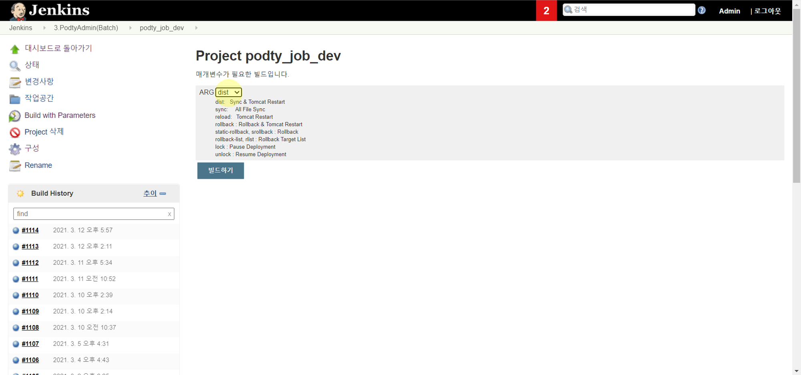

# CD, CD

## CI/CD에 대하여

CI

* Continuous Integration\(지속적 통합\)
* **모든 개발이 끝난 이후에 코드 품질을 관리**하는 **고전적인 방식의 단점**을 해소하기 위해 나타난 개념
* **개발을 하면서** **코드에 대한 지속적인 통합**을 진행함으로써 품질 유지하는 방법!
* 과정
  1. 자신의 코드를 중앙 코드와 통합\(git에 merge\)
  2. 통합된 코드가 제대로 동작하는 테스트
  3. 통합된 코드가 제대로 빌드되는지 테스트
  4. 버그가 있다면 수정한다 

CD

* Continous Delploy\(지속적 배포\)
* CI가 빌드 및 테스트 자동화라면 CD는 지속적인 배포\(무중단 배포\)에 대한 개념이다
* CD가 되려면 항상 **CI가 선행**되어야 한다

  * CI가 정상적으로 수행되고 나면 빌드된 파일을 CD에 전달
  * CD에서는 받은 파일을 전처리/후처리 등을 수행하여 배포
    * 기존에 동작하던 애플리케이션 종료, 업데이트된 빌드 파일로 애플리케이션 구동
    * 무중단 배포의 경우, 새로 업데이트된 파일을 다른 포트에 풀어놓고, 구동이 완료되면 프락시에서 들어오는 요청을 스위칭

  ​

_개발자가 직접? 너무 귀찮다..._

git에 코드만 올려놓으면 알아서 테스트와 빌드 수행하고, 결과를 개발자에게 자동으로 알려주는 **자동화 프로그램**이 있으면 좋겠다!

## 자동화 프로그램

CI를 하기 위해서 코드 수정이 있을때마다 코드 통합, 테스트, 빌드 테스트, 빌드, 배포하는 과정이 계속해서 반복되는데 이러한 과정을 자동으로 수행해주는 프로그램이 **자동화 프로그램**이다.

아래와 같은 과정을 거친다.

* 트리거\(git에 코드를 올리는 행위, 시작 버튼 등등\)
* CI/CD 를 위한 나머지 과정 자동으로 수행
* 모든 과정이 끝나면 그 결과를 개발자에게 리포트

### Jenkins

* CI/CD를 제공하는 툴
* 자동화 테스트 
  * git과 같은 버전관리시스템과 연동하여 코드 변경을 감지하고 자동화 테스트를 수행
* 빌드 자동화
  * Java 같은 경우 Maven, Gradle 빌드 툴과 연동하여 빌드 자동화

대략적인 구조

출처: [https://dundung.tistory.com/223](https://dundung.tistory.com/223)

### job 개발 서버 배포하기

1. develop 브랜치에 merge
   1. merge 당할 브랜치로 이동
   2. `git merge --no-ff {브랜치명}`
      * `--no-ff`은 fast-forward 관계인 경우에도 반드시 병합 커밋을 만드는 명령어
   3. `git push` 
2. 배치 끄기
   * alpha-job.podty.com
   * 개발용-배치관리-전체끄기
   * 다시 돌려놔야함 주의
3. 배포

* 빌드, 배포할 프로젝트 선택

* `Build with Parameter` 클릭

* ARG
  * dist : 서버
  * sync : 정적 파일

* 결과 확인!
* 배치 켜기

## 참고

[우아한 Tech 10분 테코톡](https://www.youtube.com/watch?v=6SvUZqbU37E)

[https://itholic.github.io/qa-cicd/](https://itholic.github.io/qa-cicd/)

[https://dundung.tistory.com/223](https://dundung.tistory.com/223)

