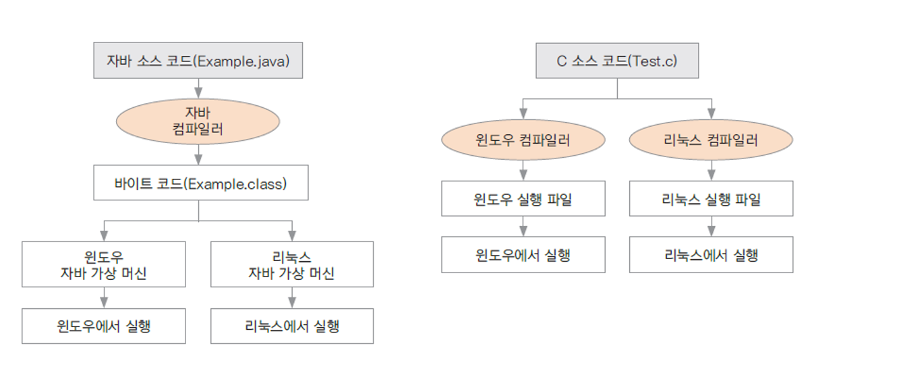

## Java 기초

> 패스트캠퍼스 Java 웹 개발 마스터 올인원 패키지 Online. 강의 정리

### Java 특징

1. 이식성이 높다

   OS에 따라 각각 컴파일을 해줘야하는 다른 언어들과 달리 Java는 컴파일러가 중간 기계어인 바이트코드(`.class`)를 만들고, 이 바이트코드는 가상머신(`jvm`) 상에서 OS와 상관없이 실행되기 때문에 이식성이 높다. 

   

   `컴파일`이란?

   - 프로그래밍 언어를 기계어로 바꾸어 주는 일
   - 자바를 설치하면 컴파일러도 함께 설치됨

2. 객체지향언어(OOP)

   자바는 처음부터 OOP(Object Oriented Programming) 개발용으로 설계된 언어이다. 따라서 유지 보수와 확장성이 좋다는 특징이 있다. OOP에 대한 내용은 추후 정리할 예정이다. 

3. 메모리를 자동으로 관리

   일반 프로그램은 실행되기 위해서 운영체제의 제어 아래에서 메모리를 제어하여 실행되지만 자바 프로그램은 JVM이 운영체제로부터 메모리를 할당받아 프로그램을 실행하게 되는 구조이다. 

   즉, 프로그램이 실행되면 JVM은 운영체제로부터 메모리를 할당 받으며, 할당 받은 메모리를 용도에 따라 여러 영역으로 나누어 관리하게 된다. 

   JVM을 한번 더 거쳐가는 구조이기 때문에 일반 프로그램에비해 속도가 낮지만 메모리를 직접 핸들링하지 않기 때문에 안정적이라는 장점이 있다. 

   

4. JDK가 제공하는 풍부한 라이브러리, 다양한 오픈 소스와 연동

### Java로 만들 수 있는 프로그램

- 웹 서버 

  가장 많이 사용!

- 모바일 앱(안드로이드)

- 게임

### JDK,  JRE,  JVM?

혼동하기 쉬운 용어를 정리해보자.

`JVM`

- 자바 가상 머신(Java Virtual Machine)의 약자
- 자바 소스코드로부터 만들어지는 **바이너리 파일(.class)을 실행해주는 가상 머신**.   
- 플랫폼에 의존적으로 리눅스의 JVM과 윈도우의 JVM은 다르다. 
- 컴파일된 바이너리 코드는 어떤 JVM에서도 동작시킬 수 있기 때문에 WORA(Write Once Run Anywhere)를 만족한다. 

`JRE`

- 자바 실행환경(Java Runtime Environment)의 약자
- **JVM이 바이너리 파일을 실행할 때 필요한 라이브러리 파일들과 기타 파일들을 가지고 있다**
- 즉, JRE는 JVM의 실행환경을 구현한 것이라고 할 수 있다.

`JDK`

- 자바 개발 도구(Java Development Kit)의 약자

- JRE와 javac 등의 개발을 위해 필요한 도구를 포함한 프로그램이다. 

  - apt: 어노테이션 툴

  - appletviewer: 웹 브라우저 없이 자바 애플릿을 실행하고 디버깅하기 위한 툴

  - javac: 자바 컴파일러(소스코드를 바이트코드로 변환) 

  - java: javac가 만든 클래스 파일을 해석 및 실행

  - JRE(Java Runtime Environment)

  - JVM(Java Virtual Machine)

    ...등

- 오라클사에서 제공하는 오라클 JDK와 오픈소스로 개발된 OpenJDK가 있다. 

