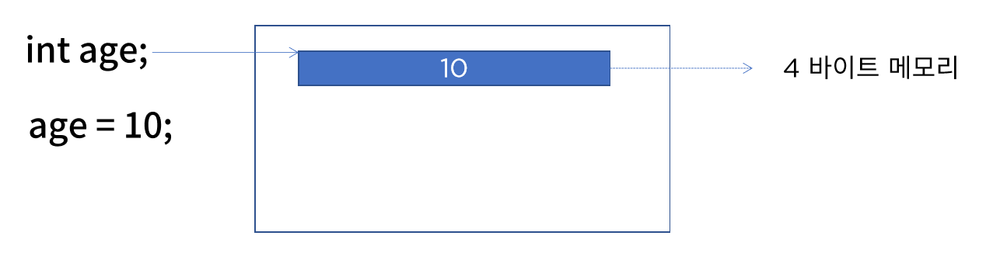
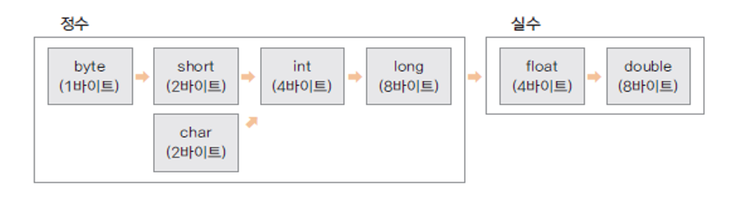

# 변수와 자료형

> 패스트캠퍼스 Java 웹 개발 마스터 올인원 패키지 Online. 강의 정리

### 변수와 메모리

**변수를 선언**하는 것은 **해당 자료형의 크기 만큼의 메모리를 사용**하겠다는 것이다.

예를 들어 `int age;`라고 변수를 선언하면 정수 자료형의 크기인 4바이트가 메모리에 잡히게 된다. 그리고 해당 메모리 위치를 변수 이름인 `age`로 참조할 수 있다. 



변수 이름 규칙

- 영문자나 숫자 사용
  - 단, 숫자로 시작할 수 없음
- 특수문자 중에는 `_`와 `$`만 사용 가능
- 예약어는 사용할 수 없음
- 가독성 중요하기 때문에 약어로 쓰지않는 것이 좋음

- 카멜케이스 ex) `numberOfStudent`


### 자료형

자료형 구분

- `기본형`

  언어에서 기본적으로 제공해주는 자료형으로, 메모리의 크기가 정해져 있다.

  ex) 정수형, 문자형, 실수형, 논리형, ...

- `참조형`

  클래스 자료형으로, JDK에서 제공되는 클래스와 프로그래머가 정의하는 클래스가 있을 수 있다. 

  클래스에 따라 사용하는 크기가 다르다. 

  ex) String(JDK가 제공), Student(직접 정의), ...

**정수형**

- byte(byte)

- short(2byte)

- **int(4byte)** : 기본적으로 java에서 정수형으로 사용

  - 32 bit : -2^31 ~ (2^31-1) 범위의 숫자 표현 가능

- long(8byte)

  ```java
  long lVal = 12345678900;
  ```

  - 위와 같이 정의하면 빨간줄이 뜨는 걸 확인할 수 있다.
  - 자바에서는 숫자와 문자를 `리터럴`로 관리하는데 숫자는 무조건 4byte로 관리하기 때문이다. 다음과 같이 `L`을 붙여주면 자바가 해당 숫자를 Long으로 처리해준다. 

  ```java
  long lVal = 12345678900L;
  ```

**문자형**

컴퓨터에서 문자를 어떻게 저장할까? 당연히 비트의 조합으로 표현한다. 

- 인코딩 

  각 문자에 특정한 숫자 값을 부여

- 디코딩 

  숫자 값을 원래의 문자로 변환

`문자세트`란?

문자를 비트로 저장하기 위해 코드 값들을 정해 놓은 세트로 아스키(ASCII), 유니코드(Unicode) 등이 있다(자바는 유니코드 사용).

```java
char ch = 'A';

System.out.println(ch); // A
System.out.println((int)ch); // 65
```

- `A`는 자바 내부적으로 65로 저장된다!

- char(2byte) 

**실수형**

컴퓨터에서 실수는 **부동 소수점 방식으로 저장**한다. 

예를 들어 0.1은 1.0(가수) * 10^-1(지수)로 표현할 수 있다. 이렇게 지수와 가수로 표현되는 부동 소수점은 0을 표현할 수 없기 때문에 약간의 오차가 발생할 수 있다.

- float(4byte)
- **double(8byte)** : 기본적으로 java에서 실수형으로 사용

**논리 자료형**

- boolean(1byte)
  true / false


### 상수와 리터럴

상수 

- 변하지 않는 수
- `final` 키워드로 변수 선언

리터럴(Literal)

- 프로그램에서 사용하는 **모든 숫자, 값, 논리 값** 
- **모든 리터럴은 상수 풀에 저장**되어 있다. 
  - 상수 풀에 저장될 때 정수는 int(4byte), 실수는 double(8byte)로 저장된다. 
  - 만약 정수에 `L` 실수에 `F`를 붙여주면 각각 8byte, 4byte로 공간을 잡아서 값을 저장한다. 
  - 상수풀은 자바 프로세스의 종료까지 계속 유지되는 메모리 영역으로 기본적으로 JVM에서 관리하며 프로그래머가 작성한 상수에 대해서 우선적으로 찾아보고 없으면 상수풀에 추가한 이후 그 주소값을 리턴한다. 
  - 즉, 메모리 절약 효과를 위해 사용!


### 형변환

서로 다른 자료형의 값이 대입되는 경우 형 변환이 일어난다. 



왼쪽에서 오른쪽으로 갈 수록 더 정밀한 수로, 왼쪽에서 오른쪽으로 형변환이 일어나는 것은 묵시적 형 변환, 그 반대는 명시적 형 변환이라고 한다.

서로 다른 자료형의 변수를 계산하면 덜 정밀한 변수가 더 정밀한 수로 자동으로 형변환된다.  

- 묵시적 형 변환

  ```java
  byte bNum = 10;
  int iNum = bNum; 
  ```

  작은 수에서 큰 수로, 덜 정밀한 수에서 더 정밀한 수로 대입되는 경우이다.

- 명시적 형 변환

  자료의 손실이 발생할 수 있기 때문에 타입 캐스팅을 해줘야한다.

  ```java
  int iNum2 = 20;
  float fNum = iNum2; // 실수가 정수보다 더 정밀한 수
  
  double dNum;
  dNum = fNum + iNum; // iNum이 float형으로 바뀜 -> float이 double로 바뀜
  
  int i = 1000;
  byte bNum = i; // 에러!
  
  // 명시적 형변환
  int i = 1000;
  byte bNum = (byte)i; // 타입 캐스팅
  System.out.printLn(bNum); // -24 -> 데이터 유실 발생
  ```

  

