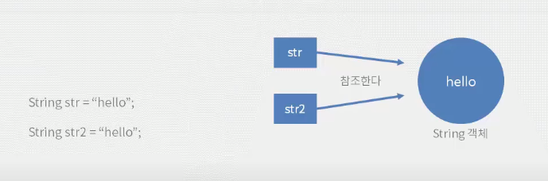

## String 클래스

> 자바 문법에서 가장 많이 사용하는 클래스인 String을 알아보자.


### 참조타입

자바형 변수 타입은 기본형, 참조형이 있다.

- 논리형(boolean), 문자형(char), 정수형(byte, short, int, long), 실수형(float, double)은 기본형 변수 타입이다.
- 배열, 클래스 등 기본형 타입을 제외한 모든 변수는 참조형 타입이다. 

```java
String str = new String("Hello World");
```

- `new` 라는 키워드는 메모리에 인스턴스를 올려라는 뜻이며, 여기서 str은 메모리에 올라간 인스턴스를 가리키며 인스턴스와 다른 메모리 영역에 저장된다. 
- 즉, str은 String 객체의 메모리 위치를 가지는 참조형 변수이다. 


### String 클래스의 특징

1. String 클래스는 다른 클래스와 다르게 `new` 키워드를 사용하지 않고 인스턴스를 생성할 수 있다.

```java
// new 키워드 사용x
String str1 = "hello";
String str2 = "hello";

// new 키워드를 사용
String str3 = new String("hello");
String str4 = new String("hello");
```



- 이렇게 생성된 문자열은 메모리 중 **상수가 저장되는 영역(상수 풀)에 저장**된다.
  - 상수풀이란 힙 영역에 생성되어 프로세스 종료까지 유지되는 메모리 영역이다. 
  - str2는 str1과 같은 인스턴스를 참조한다.
  - 따라서 메모리를 아끼려면 `new`를 사용하지 않는 것이 좋다. 

- `new` 키워드를 이용하여 인스턴스를 만들면 인스턴스는 항상 새로운 메모리에 만들어진다. 
  - str4는 str3과 서로 다른 인스턴스를 참조한다. 

```java
System.out.println(str1 == str2); // true
System.out.println(str1 == str3); // false
System.out.println(str3 == str4); // false
```

- 참조 변수를 `==`로 비교하면 실제 값이 아닌 서로 같은 것을 참조하는지(실제 가리키는 메모리 영역의 주소가 같은지)를 비교한다.


2. 한번 생성된 String 클래스는 변하지 않는다.

```java
System.out.println(str1); // hello
System.out.println(str1.substring(3)); // lo
System.out.println(str1); // hello
```

- String은 여러 변수가 같은 값을 참조할 수 있기 때문에 값이 변경되면 다른 참조형 변수에 영향을 줄 수 있다. 따라서 한번 생성된 String 클래스는 변하지 않는다. 
- String은 다양한 메소드를 가지고 있으며, 메소드로 호출한다고해서 내부의 값이 변하지는 않는다. 
- String 메소드가 반환하는 값은 모두 새로운 String을 생성해서 반환한다. 


### String 클래스의 메소드

```java
String str = "hello";
```


문자열 길이 구하기(`length`)

```java
System.out.println(str.length()) // 5
```

- str이 참조하는 문자열의 길이를 구해서 int 타입으로 리턴해주는 메소드이다. 


문자열 붙히기(`concat`)

```java
System.out.println(str.concat(" world")); // hello world 
System.out.println(str); // hello
```

- str이 참조하는 문자열에 메소드의 인자로 들어오는 문자열을 붙혀서 String 타입으로 리턴하는 메소드이다. 

- String은 불변 클래스로 원래 클래스는 변하지 않는다. 
- 따라서 자바는 `hello world`라는 새로운 String 객체를 생성해서 반환한다. 
- 만약 str이 참조하는 값을 메소드의 결과물로 변경하고 싶으면 아래와 같이 변수를 재 할당 해주면 된다. 

```java
str = str.concat(" world"); 
```


문자열 자르기(subString)

- substring(`beginIndex`) : `beginIndex`부터 마지막 글자까지 반환
- substring(`beginIndex`, `endIndex`) : `beginIndex`부터 `endIndex`까지 반환

```java
System.out.println(str.substring(1, 3)); // el
System.out.println(str.substring(2));   // llo world
```

