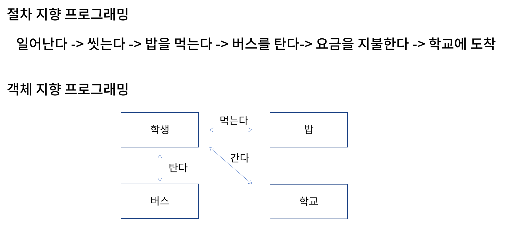
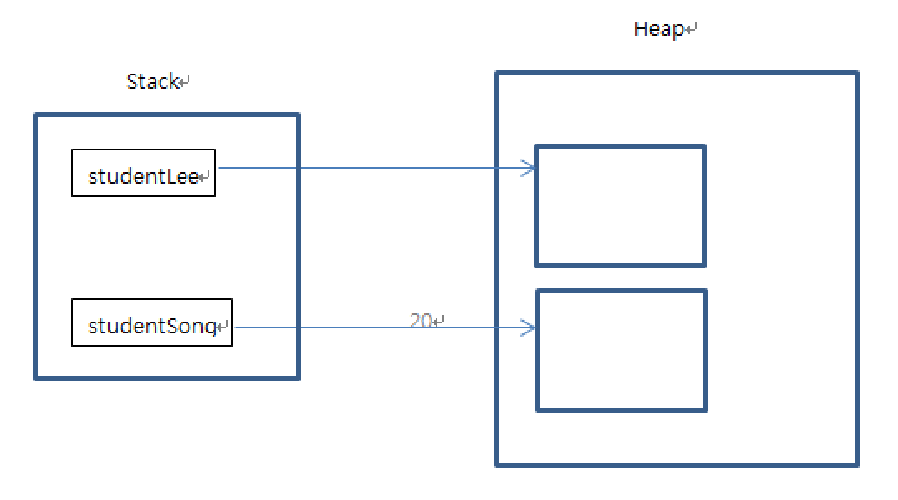

## 객체지향 프로그래밍

객체(Object)란?

- 프로그래밍을 할 때 구체적, 추상적 데이터의 단위
- 객체들의 연관관계를 통해 프로그래밍하는 것을 객체 지향 프로그래밍(Object Oriented Programming)이라고 한다.
- 참고로, 시간이나 사건의 흐름에 따라 프로그래밍하는 것은 절차 지향 프로그래밍(Procedural Programming)이다.



### 클래스

클래스란?

- 객체를 코드로 구현한 것
- 객체의 청사진
- (멤버)변수와 메서드로 이루어져있다.

```java
//클래스 예시
package classpart;

public class Student {
    
    public int studentID;
    public String studentName;
    public String address;
    
    public void showStudentInfo() {
        System.out.println(studentName + "," + address);
    }
}
```

```java
// 다른 클래스에서 Student 객체를 사용하는 방법

package classpart;

public class StudentTest {
    public static void main(String[] args) {
        
        Student studentLee = new Student(); // 생성자로 인스턴스 생성
        
        studentLee.studentName = '이순신';
        studentLee.address = '서울';
    }
}
```

- `new 클래스명()` 와 같이 작성하면 **메모리에 해당 클래스 크기의 공간이 할당**된다. 
- 자바 파일 하나에 여러 개의 클래스가 존재할 수 있지만, public 클래스는 하나여야한다.


### 메서드와 메모리

메서드란?

- 객체의 기능을 구현하기 위해 클래스 내부에 구현된 함수이다.

```java
public static int addNum(int num1, int num2) {
    int result;
    result = num1 + num2;
    return result;
}

public static void sayHello(String greeting) {
    System.out.println(greeting);
}

public static int calcSum() {
    int sum = 0;
    int i;
    
    for(i = 0; i<=100; i++) {
		sum += i;
    }
    return sum;
}

public static void main(String[] args) {
    int n1 = 10;
    int n2 = 20;
    
    int total = addNum(n1, n2);
    sayHello("안녕하세요.");
    int num = calcSum();
    
    System.out.println(total);
    System.out.println(num);
}
```

- 함수 호출에서 사용하는 메모리는 **스택 메모리**이다.

- `main()` 함수를 실행하면 내부적으로 다음과 같이 진행된다.

  1. `main()` 함수 실행 

     스택 메모리에 `n1`, `n2` 값이 쌓이고, `addNum()` 함수 호출

  2. `addNum()` 함수 실행

     `num1`은 `n1`이 , `num2`는 `n2`가 복사되고 `result`값이 스택 메모리에 쌓인다.

  3. `addNum()` 메모리 사라지며 `main()` 메모리에 `result` 값 쌓인다.

  4. ...

- 즉, 지역 변수(블록 내부 변수)는 함수가 호출될 때마다 스택 메모리에 쌓였다가 함수가 끝나면 메모리 상에서 사라지게 된다.

- 멤버 변수(클래스 내부 변수)의 경우 메모리에 쌓이는 방식이 다르며 이후 더 자세히 다루겠다. 


### 인스턴스와 메모리

인스턴스란?

- 클래스로부터 생성된 객체
- 하나의 클래스로 여러개의 인스턴스를 생성할 수 있으며 **각각의 인스턴스는 각각의 메모리에 갖게**된다. 
- 이때 **힙 메모리에 멤버 변수의 크기에 따라 메모리가 생성**된다.

 

```java
package classpart;

public class StudentTest {
    public static void main(String[] args) {
        
        // studentLee는 Student로 생성된 인스턴스를 가리키는 '참조 변수'!
        Student studentLee = new Student(); 
        studentLee.studentName = '이순신';
        studentLee.address = '서울';
        
        Student studentSong = new Student(); 
        studentLee.studentName = '송유신';
        studentLee.address = '부산';
    }
}
```

- **`new` 키워드로 인스턴스를 생성하면 힙 메모리에 멤버 변수(`studentName`, `address`) 만큼의 메모리가 할당**된다. 
- 참조 변수(`studnetLee`, `studentSong`)은 stack메모리에 저장되어 각각 힙 메모리의 멤버 변수를 가리킨다. 
  - 즉, `studentLee` 뒤에 `.`을 붙히면 해당하는 힙 메모리를 가리키게 된다. 

- 힙 메모리 상의 메모리는 GC(가비지 콜렉터)에 의해 수거된다. 

```java
System.out.println(StudentLee); 
// classpart.Student@15db9742
```

- 참조 변수 값을 출력 이런 문자가 나오는 것을 볼 수 있다. 
- 이는 `package.class풀네임@인스턴스(힙메모리)주소값의 해시값` 이다.


### 참고) Java 변수 종류

변수의 종류를 결정짓는 것은 변수가 선언된 위치이다.

```java
public class test {
    int iv;
    static int cv;
    
    void method() {
        int lv;
    }
}
```

멤버 변수(`iv`, `cv`)

- 클래스 내부에 선언된 변수
- 인스턴스 변수/클래스 변수로 나뉜다.

인스턴스 변수(`iv`)

- **인스턴스가 생성될 때 생성**된다. 
- 그렇기 때문에 인스턴스 변수의 값을 읽어오거나 저장하려면 인스턴스를 먼저 생성해야한다. 
- 인스턴스 별로 다른 값을 가질 수 있으므로, 각각의 인스턴스마다 고유 값을 가져야할 때 인스턴스 변수로 선언한다.

클래스 변수(`cv`)

- 인스턴스 변수에 **static**만 붙여주면 된다. 

- **클래스가 로딩될 때 생성**되기 때문에 메모리에 딱 한번만 올라간다. 
- 클래스 변수는 **모든 인스턴스가 공통된 값을 공유**하게 된다. 
- 인스턴스를 생성하지 않고 `클래스이름.클래스변수명`을 통해 접근할 수 있다.  

지역 변수(`lv`)

- 메서드 내에서 선언되며 **메서드 내에서만 사용**할 수 있는 변수
- 메서드가 실행될 때 **스택 메모리에 할당** 받으며 **메서드가 끝나면 소멸**된다. 

